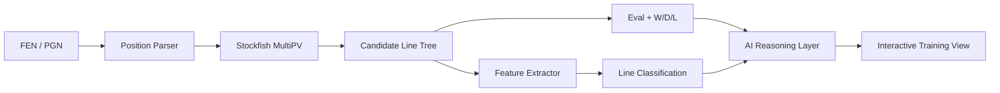

# Chess Decision Intelligence

An interactive chess analysis and training platform focused on understanding **what to play, why it works, and what kind of position each line leads to**.

The project is being built to go beyond standard engine analysis by combining Stockfish calculation, live outcome probabilities, positional feature extraction, and an AI reasoning layer that explains plans and classifies candidate lines by practical playing style.

> **Status:** Active development.

## What I'm Building

The platform takes a FEN or PGN position and generates a structured decision tree for the next few moves.

For each candidate line, the system is designed to provide:

- Engine evaluation
- Win / draw / loss probabilities
- Multiple strong continuations using MultiPV
- Best replies for both sides
- Tactical and positional classification
- Safety and risk indicators
- Practical playability
- Strategic explanations
- Recurring positional ideas across lines

## Line Classification

Each line can carry multiple labels rather than being forced into a single category.

Examples:

- Attacking
- Defensive
- Tactical
- Positional
- Safe / Solid
- Forcing
- Complex
- Simplifying
- Counterattacking
- High-risk
- Kingside attack
- Queenside attack
- Center-focused

The goal is to help answer not only:

> What is the best move?

but also:

> Which line is safer?

> Which line is more tactical?

> Which continuation gives me the initiative?

> Which position is easier to play practically?

## Core Analysis Flow



## Engine + AI Architecture

Stockfish remains the source of chess calculation.

The AI layer is used for interpretation, not for deciding the best move.

```text
Stockfish
  ↓
Engine lines, evals, W/D/L
  ↓
Structured positional features
  ↓
AI reasoning layer
  ↓
Human-readable plans, line labels, comparisons, training prompts
```

This keeps the analysis grounded in a deterministic chess engine while making the output more useful for learning.

## Position Features

The analysis layer is being designed to inspect features such as:

- Material balance
- King safety
- Development
- Pawn structure
- Piece activity
- Weak squares
- Open and semi-open files
- Space
- Passed pawns
- Isolated and doubled pawns
- Outposts
- Checks, captures and threats
- Pins, forks and discovered attacks
- Evaluation volatility
- Move forgiveness

## Practical Metrics

In addition to raw engine evaluation, the platform is intended to expose practical metrics such as:

- Tactical richness
- Attack potential
- Safety
- Complexity
- Forcing nature
- Forgiveness
- Practical difficulty
- Resulting-position risk

A move that is slightly weaker by engine evaluation may still be easier to play, more forcing, or more effective at a particular rating level.

## Planned Tech Stack

**Backend**
- Python
- FastAPI
- python-chess
- Stockfish / UCI

**Frontend**
- React / Next.js
- Interactive chessboard UI
- Variation tree visualization

**Data**
- SQLite initially
- PostgreSQL as analysis history and training data grow

**AI Layer**
- LLM-backed explanation and classification
- Structured prompts grounded in engine output and extracted board features

## Example Output

```text
18. Bc4

Engine: +0.48
W/D/L: 41 / 44 / 15

Style:
- Attacking
- Tactical
- Initiative-driven

Attack:       8.2 / 10
Tactics:      7.4 / 10
Safety:       5.1 / 10
Complexity:   8.0 / 10
Forgiveness:  4.2 / 10

Main idea:
Develop with tempo, increase pressure on f7,
and preserve the initiative before Black consolidates.
```

## Training Direction

The longer-term goal is to turn the analysis engine into a training system.

Planned training modes include:

- Guess the best candidate moves
- Guess the positional plan
- Compare safe vs sharp continuations
- Identify recurring ideas in a specific opening
- Study common middlegame structures
- Compare engine-best and practical-best choices

## Repository Scope

This repository documents the public-facing architecture, analysis model, and roadmap for the project.

Implementation is being developed iteratively, with the initial focus on:

1. Position parsing
2. Stockfish MultiPV analysis
3. Recursive variation-tree generation
4. Live W/D/L output
5. Line-style classification
6. Positional feature extraction
7. AI-assisted explanation
8. Interactive training workflows

## Documentation

- [Architecture](docs/ARCHITECTURE.md)
- [Analysis Model](docs/ANALYSIS_MODEL.md)
- [AI Reasoning Layer](docs/AI_LAYER.md)
- [Roadmap](docs/ROADMAP.md)
