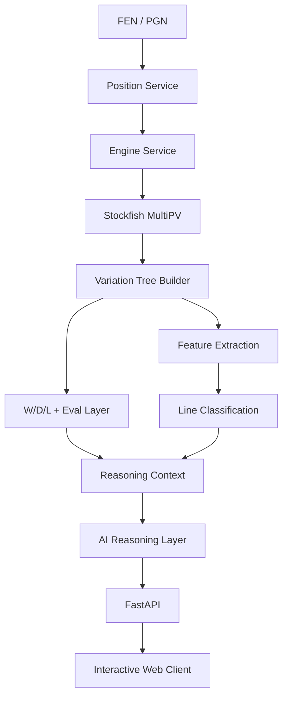

# Architecture

The platform is designed as a hybrid chess-analysis system.

Stockfish handles calculation. Structured services extract board features and transform engine output into a decision tree. An AI reasoning layer then converts those grounded signals into concise strategic explanations and training insights.



## Core Services

### Position Service

Responsibilities:

- parse FEN
- parse PGN
- validate positions
- generate legal moves
- apply moves
- convert between SAN and UCI representations

### Engine Service

Responsible for Stockfish communication through UCI.

Initial capabilities:

- position evaluation
- MultiPV analysis
- configurable depth / node limits
- principal variations
- W/D/L extraction
- streaming analysis updates

### Variation Tree Builder

Turns engine output into an explorable decision tree.

A typical branching strategy may use:

```text
Root:
  Top 3 candidate moves

Next ply:
  Top 2 opponent replies

Following ply:
  Top 2 continuations

Deeper:
  Selective expansion
```

This avoids uncontrolled tree growth while preserving meaningful alternatives.

### Feature Extractor

Computes structured chess features independently of the AI layer.

Examples:

- material
- mobility
- king safety
- pawn weaknesses
- open files
- weak squares
- tactical motifs
- forcing moves
- evaluation volatility

### Line Classification

Uses engine and board features to score properties such as:

```text
attack_score
tactical_score
safety_score
complexity_score
forcing_score
forgiveness_score
```

A line may then receive labels such as:

```text
ATTACKING
TACTICAL
SAFE
DEFENSIVE
POSITIONAL
FORCING
SIMPLIFYING
COMPLEX
```

### AI Reasoning Layer

The AI layer receives only grounded chess context.

It does not independently choose the best move.

Its role is to:

- explain why a move works
- summarize the strategic plan
- compare candidate lines
- describe the resulting position
- generate concise training prompts

## API Layer

FastAPI will expose endpoints for:

- position analysis
- variation-tree retrieval
- node expansion
- line comparison
- training questions
- saved analysis sessions

## Frontend

The web client is intended to provide:

- interactive board
- candidate move ranking
- clickable variation tree
- live W/D/L updates
- style filters
- positional summaries
- training mode
